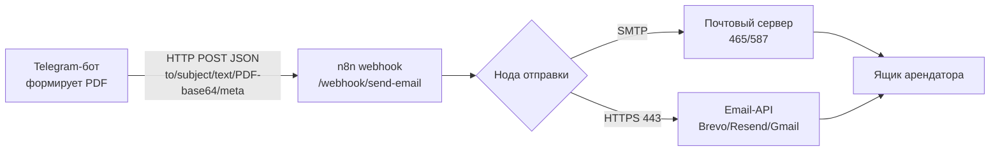

# Отправка документов через n8n — подробная пошаговая установка

Цель: чтобы бот учёта аренды отправлял все PDF-документы (УПД по аренде, УПД по
электричеству, квитанции) через n8n, поднятый на **том же сервере**. Инструкция
рассчитана на то, что вы делаете это впервые — с объяснением, зачем каждый шаг.

---

## 0. Как это устроено (обязательно прочитать)



Что происходит:

1. В боте выбран транспорт `EMAIL_PROVIDER=n8n`. Когда нужно отправить документ,
   бот формирует PDF и делает **HTTP POST** на адрес `EMAIL_N8N_URL` с JSON, где
   лежит всё для письма: адресат, тема, текст, отправитель, метаданные и вложения
   (PDF в base64). Формат — см. раздел 8.
2. n8n принимает этот POST своим узлом **Webhook** и отправляет письмо своим узлом
   отправки.
3. Бот **не** ходит в почту напрямую — этим занимается n8n.

### Зачем вообще n8n, если он на том же сервере

Главная причина — хостеры часто **блокируют исходящий SMTP** (порты 25/465/587),
и бот не может подключиться к smtp.gmail.com («Network is unreachable»). Порт
**443 (HTTPS) почти всегда открыт**. n8n позволяет отправлять письмо через узел,
работающий по 443 (email-API вроде Brevo/Resend или Gmail API), в обход блокировки.

> ⚠️ **Важно понимать (для РФ):** блокировка SMTP обычно **избирательная**. С
> российского сервера часто НЕ доходит именно до Google (`smtp.gmail.com`), т.к.
> Google в РФ деградирует, — но **российские почтовые хосты (Яндекс, Mail.ru) по
> SMTP, как правило, доступны**. Иностранные email-API (Brevo/SendGrid/Resend) в РФ
> тоже часто недоступны или требуют зарубежный телефон. Поэтому для РФ: если у хостера
> открыт SMTP — **Вариант A на Яндекс.Почте/Mail.ru** (SMTP-нода n8n); если SMTP закрыт
> полностью (частый случай) — **Вариант B через российский ESP UniOne по 443**
> (раздел 5). Что открыто именно у вас — проверьте диагностикой в разделе 3.

---

## 1. Предварительные требования

- Сервер с Docker и docker compose (проект уже так запускается).
- Проект склонирован, рабочая ветка подтянута:
  ```bash
  git fetch origin && git checkout claude/migration-service-error-1bjg1w && git pull
  ```
- Файл `.env` в корне проекта (скопируйте из `.env.example`, если ещё нет).
- Почтовый ящик, от имени которого будете слать и на который принимать письма.
  Для РФ — **Яндекс.Почта или Mail.ru** (Вариант A). Тот же ящик используется и для
  приёма писем через n8n (раздел «Приём писем»).

Сервис `n8n` уже описан в `docker-compose.yml` (порт `5678`, том `n8n_data` для
хранения воркфлоу и учёток). Бот и n8n в одной compose-сети, поэтому бот обращается
к n8n по **внутреннему имени** `n8n`, наружу порт открывать не обязательно.

---

## 2. Шаг 1. Поднять n8n

```bash
docker compose up -d n8n
docker compose ps          # n8n должен быть Up
docker compose logs -f n8n # смотрим лог запуска (Ctrl+C для выхода)
```

Что означают переменные n8n в `docker-compose.yml` (можно задать в `.env`):

| Переменная | Зачем |
|------------|-------|
| `N8N_HOST` | внешнее доменное имя n8n (для ссылок и OAuth). Для локального теста — `localhost` |
| `N8N_PROTOCOL` | `http` или `https` (за reverse-proxy) |
| `N8N_PORT` | порт внутри контейнера (5678) |
| `GENERIC_TIMEZONE` | таймзона расписаний (берётся из `TZ`) |
| `N8N_USER` / `N8N_PASSWORD` | логин/пароль базовой авторизации (только старые версии n8n, см. ниже) |

> Том `n8n_data` хранит все воркфлоу, учётные данные и историю. Не удаляйте его —
> иначе настройки n8n пропадут. Бэкап тома — раздел 11.

---

## 3. Шаг 2. Первый вход в n8n

Откройте в браузере `http://<IP-или-домен-сервера>:5678`.

### Если n8n не пускает: «secure cookie … insecure URL»

По умолчанию n8n требует защищённую cookie и **не даёт войти по http с IP-адреса**.
Три способа (по возрастанию безопасности):

- **Быстро (доверенная сеть):** разрешить http-вход. В `.env` задайте
  `N8N_SECURE_COOKIE=false` и пересоздайте контейнер:
  ```bash
  docker compose up -d n8n
  ```
- **Безопасно, без TLS — SSH-туннель.** На своём компьютере:
  ```bash
  ssh -L 5678:localhost:5678 root@<IP-сервера>
  ```
  и откройте `http://localhost:5678` — через localhost n8n пускает по http, менять
  ничего не нужно (оставьте `N8N_SECURE_COOKIE=true`).
- **Продакшн:** reverse-proxy (nginx/Caddy) с HTTPS, `N8N_PROTOCOL=https`,
  `N8N_HOST=домен` (раздел 11).

- **Свежие версии n8n** (наш образ `n8nio/n8n:latest`) при первом входе просят
  **создать аккаунт владельца** — введите email и пароль. Это ваш вход в n8n
  (переменные `N8N_USER/N8N_PASSWORD` в новых версиях игнорируются).
- **Старые версии** — спросят логин/пароль из `N8N_USER` / `N8N_PASSWORD`.

Запишите пароль — он понадобится при каждом входе.

### Заодно: какой почтовый хост доступен с сервера?

Блокировка избирательная, поэтому проверяем СРАЗУ несколько хостов из контейнера
n8n (SMTP-порт отправки 465 и IMAP-порт приёма 993):

```bash
docker compose exec n8n node -e "const net=require('net');[['smtp.yandex.ru',465],['imap.yandex.ru',993],['smtp.mail.ru',465],['imap.mail.ru',993],['smtp.gmail.com',465]].forEach(([h,p])=>{const s=net.connect(p,h);s.setTimeout(6000);s.on('connect',()=>{console.log('OK   ',h+':'+p);s.end()});s.on('timeout',()=>{console.log('TIMEOUT',h+':'+p);s.destroy()});s.on('error',e=>console.log('FAIL ',h+':'+p,e.message))})"
```

- `OK smtp.yandex.ru:465/587` (или mail.ru) → идём **Вариантом A на Яндекс/Mail.ru**.
- **Все SMTP-порты (465/587/25/2525) в FAIL/TIMEOUT** (частая антиспам-политика
  хостера) → отправка по SMTP невозможна, идём **Вариантом B (UniOne, раздел 5)** —
  по HTTPS 443. При необходимости можно попросить хостера открыть исходящий 587.
- IMAP-строки (`imap.*:993`) нужны для **приёма** писем через n8n (раздел «Приём»)
  и обычно открыты, даже когда SMTP закрыт.

---

## 4. Вариант A (рекомендуется для РФ). Отправка через SMTP-ноду на Яндекс/Mail.ru

Подходит, когда доступен российский SMTP-хост (см. раздел 3). Пример на
**Яндекс.Почте**; для Mail.ru всё аналогично (хосты — в таблице ниже).

### 4.1. Получить пароль приложения Яндекс

Обычный пароль не подойдёт — нужен **пароль приложения**:

1. Включите доступ по протоколам: **Яндекс.Почта → Настройки → Почтовые программы**
   → включите **«С сервера imap.yandex.ru по протоколу IMAP»** и разрешите доступ
   по паролям приложений.
2. **Яндекс ID → Безопасность → Пароли приложений → Создать** → тип «Почта» →
   скопируйте выданный пароль.
   - Регистрация ящика делается по **российскому** номеру — зарубежный не нужен.

Хосты почтовых провайдеров:

| Провайдер | SMTP (отправка) | IMAP (приём) |
|-----------|-----------------|--------------|
| Яндекс    | `smtp.yandex.ru:465` (SSL) | `imap.yandex.ru:993` (SSL) |
| Mail.ru   | `smtp.mail.ru:465` (SSL)   | `imap.mail.ru:993` (SSL)   |

### 4.2. Импортировать воркфлоу

1. В n8n: **Workflows → (кнопка ⋮ / Import) → Import from File**.
2. Выберите файл из репозитория: `app/email/n8n_send_email_smtp.workflow.json`.
3. Появится схема: **Webhook → Подготовить письмо → Отправить письмо (SMTP) →
   Ответить боту**.
   - «Подготовить письмо» (Code-нода) раскладывает `attachments` из base64 в
     бинарные вложения `attachment_0, attachment_1, …`.

### 4.3. Создать SMTP-креденшал и привязать его

1. **Credentials → New → SMTP**. Заполните (пример для Яндекса):
   - **User**: ваш адрес целиком (`you@yandex.ru`)
   - **Password**: пароль приложения из п. 4.1
   - **Host**: `smtp.yandex.ru`
   - **Port**: `465`
   - **SSL/TLS**: включить
2. Сохраните креденшал.
3. Откройте узел **«Отправить письмо (SMTP)»** и выберите созданный SMTP-креденшал
   (в шаблоне стоит заглушка `REPLACE_WITH_YOUR_SMTP_CREDENTIAL_ID`).
4. Проверьте, что в узле:
   - **From** = `={{$json.from}}` (берётся из `EMAIL_FROM` бота; для Яндекса он
     ДОЛЖЕН совпадать с адресом ящика — Яндекс не даёт слать от чужого адреса);
   - **Options → Attachments** = `={{$json.attachmentProps}}` (список бинарных
     свойств вложений).

Перейдите к разделу 6.

---

## 5. Вариант B (для РФ). HTTPS через российский ESP — Unisender Go / UniOne

Когда исходящий SMTP закрыт полностью (все порты 465/587/25/2525 в таймаут), а
443 открыт, отправляем через **транзакционный HTTP-API UniOne (Unisender Go)** —
российский сервис, регистрация по российскому номеру, отправка от адреса **на своём
домене** (с DKIM). Готовый воркфлоу — `app/email/n8n_send_email_unione.workflow.json`.

### 5.1. Завести UniOne и подтвердить домен

1. Зарегистрируйтесь: `https://go.unisender.ru` (Unisender Go / UniOne).
2. **Settings → Sending domains** (Домены отправки) → добавьте свой домен.
3. Пропишите в DNS домена показанные записи **DKIM, SPF (и DMARC)** и дождитесь
   статуса «подтверждён». Адрес отправителя (`EMAIL_FROM`) должен быть на этом
   домене, например `noreply@ваш-домен.ru`.
4. **Settings → API keys** → создайте API-ключ, скопируйте.

> Кластер аккаунта виден в панели: РФ-аккаунты — `go1.unisender.ru` (уже прописан
> в воркфлоу). Если ваш аккаунт на другом кластере (`go2...`/`eu1...`), поменяйте
> host в URL узла «UniOne API».

### 5.2. Отдать ключ в n8n

Ключ уже проброшен в `docker-compose.yml` (сервис `n8n`, переменная
`UNIONE_API_KEY`). Задайте его в `.env` и перезапустите n8n:

```dotenv
UNIONE_API_KEY=ваш-api-ключ-unione
```

```bash
docker compose up -d n8n
```

### 5.3. Импортировать воркфлоу

1. **Workflows → Import from File** → выберите
   `app/email/n8n_send_email_unione.workflow.json`.
2. Схема: **Webhook → UniOne API → Ответить боту**. Узел «UniOne API» уже настроен:
   POST на `https://go1.unisender.ru/ru/transactional/api/v1/email/send.json`, ключ —
   из `$env.UNIONE_API_KEY`, тело письма (адресат/тема/текст/вложения-PDF) собирается
   из входящего JSON бота; `from_email` берётся из `EMAIL_FROM`.

Перейдите к разделу 6. В `.env` бота задайте `EMAIL_FROM=noreply@ваш-домен.ru`
(адрес на подтверждённом домене UniOne).

> **Вне РФ** можно так же использовать Brevo (`app/email/n8n_send_email_brevo.workflow.json`,
> ключ `BREVO_API_KEY`) или Resend/Gmail API — логика та же, меняется только узел
> отправки; вход от бота одинаковый.

---

## 6. Шаг 3. Активировать воркфлоу и узнать адрес вебхука

1. Нажмите **Save**, затем переключатель **Active** (вверху справа) — включите его.
   - Пока воркфлоу **не активен**, работает только тестовый URL
     `/webhook-test/...`, который срабатывает лишь при нажатии «Listen for test
     event». Для боевой работы нужен именно **активный** воркфлоу и **боевой** URL.
2. Откройте узел **Webhook** → там показаны два URL: **Test URL** и **Production
   URL**. Нас интересует **Production URL** с путём `/webhook/send-email`.

**Какой адрес прописать боту.** UI может показать `http://localhost:5678/webhook/send-email`,
но бот внутри compose-сети должен обращаться по **имени сервиса**:

```
http://n8n:5678/webhook/send-email
```

(имя `n8n` = имя сервиса в docker-compose; порт внутренний 5678; путь — из узла
Webhook). Именно этот адрес пойдёт в `.env` бота.

---

## 7. Шаг 4. Настроить бота и перезапустить

В `.env` бота (в корне проекта):

```dotenv
EMAIL_PROVIDER=n8n
EMAIL_N8N_URL=http://n8n:5678/webhook/send-email
EMAIL_FROM=you@yandex.ru           # адрес-отправитель (для Яндекса = адрес ящика)
# необязательно, но желательно — общий секрет; уходит в заголовке X-Webhook-Token
WEBHOOK_TOKEN=длинный-случайный-секрет
```

Перезапустите бота (пересборка обязательна, чтобы приехал свежий код):

```bash
docker compose up -d --build bot
```

Проверьте версию UI (должна быть новая): в Telegram отправьте `/version`.

---

## 8. Что именно бот шлёт в n8n (контракт)

`POST` на `EMAIL_N8N_URL`, `Content-Type: application/json`, и (если задан
`WEBHOOK_TOKEN`) заголовок `X-Webhook-Token: <секрет>`. Тело:

```json
{
  "to": "tenant@example.ru",
  "subject": "УПД № УПД-Э-17/2024-АР/09-26 по договору аренды № 17/2024-АР",
  "text": "Здравствуйте, ООО «Ромашка»! ...",
  "from": "owner@example.ru",
  "meta": {
    "document_type": "upd",
    "kind": "electricity",
    "number": "УПД-Э-17/2024-АР/09-26",
    "tenant_name": "ООО «Ромашка»",
    "contract_no": "17/2024-АР",
    "period": "2026-09",
    "amount": "3 450.00",
    "landlord_name": "ИП Иванов И.И."
  },
  "attachments": [
    { "filename": "УПД-Э-17-2024-АР-09-26.pdf", "mime_type": "application/pdf", "content_base64": "<...>" }
  ],
  "filename": "УПД-Э-17-2024-АР-09-26.pdf",
  "pdf_base64": "<...>"
}
```

- `attachments` — основной список вложений (может быть несколько PDF).
- `filename` / `pdf_base64` — дублируют **первое** вложение (для простых воркфлоу).
- `meta` — метаданные документа: `document_type` = `upd` | `receipt`, для УПД ещё
  `kind` = `rent` | `electricity`, плюс арендатор/договор/период/сумма. Удобно для
  маршрутизации и логов в n8n.

---

## 9. Шаг 5. Проверка отправки

1. В боте: `/admin → 🔌 Тест почты (без отправки)` — подтвердит, что транспорт
   `n8n` выбран и виден URL вебхука.
2. Если данных ещё нет: `/admin → 🧪 Заполнить тестовыми данными`. Убедитесь, что у
   арендатора **указан email** (иначе слать некуда).
3. Отправьте документ:
   - `/admin → 📧 УПД аренда`
   - `/admin → 📧 УПД электричество`
   - `/admin → 📧 Квитанция`
   Выберите арендатора → бот сформирует PDF и отправит в n8n.
4. В n8n откройте вкладку **Executions** — там каждое обращение к вебхуку с
   результатом. Зелёное — письмо ушло; красное — откройте и посмотрите, какой узел
   упал и с какой ошибкой.

---

## 10. Диагностика типовых ошибок

| Симптом | Причина / решение |
|---------|-------------------|
| Бот: `EMAIL_N8N_URL не задан` | Не заполнена переменная в `.env` бота. |
| Бот получает **404** от вебхука | Воркфлоу не активирован (**Active**) или путь ≠ `send-email`. Сверьте `EMAIL_N8N_URL`. |
| Бот: `Cannot connect` / таймаут к n8n | Неверный адрес. Изнутри compose это `http://n8n:5678/...`, а не `localhost`. Проверьте `docker compose ps` — n8n Up. |
| В Executions **красный SMTP-узел**, `Network unreachable` | Сервер блокирует SMTP — переключитесь на **Вариант B (HTTPS)**. |
| Письмо ушло, но **без вложения** | В SMTP-узле `Options → Attachments` должно быть `={{$json.attachmentProps}}`; проверьте, что Code-нода отработала (в Executions видны бинарные `attachment_0…`). |
| Brevo отвечает **401** | Неверный/несозданный `BREVO_API_KEY`, или переменная не проброшена в n8n (перезапустите `n8n`). |
| Brevo отвечает **400 sender not valid** | Адрес `EMAIL_FROM` не подтверждён в Brevo (**Senders**). |
| Письмо «отправлено», но не приходит | Проверьте «Спам»; для нового отправителя настройте SPF/DKIM у почтового провайдера. |

---

## 10.5. Приём писем через n8n (IMAP) — тот же ящик

Приём (чеки об оплате, показания счётчиков) уже поддержан в API: n8n читает почту,
распознаёт содержимое и делает POST в наши вебхуки. n8n **только распознаёт и отдаёт
JSON**, вся запись в БД — в приложении (`app/api/webhooks.py`).

Схема в n8n: **Email Trigger (IMAP) → (распознавание) → HTTP Request (POST в наш API)**.

1. **Credentials → New → IMAP.** Для Яндекса: Host `imap.yandex.ru`, Port `993`,
   SSL вкл., User `you@yandex.ru`, Password — тот же пароль приложения.
2. Добавьте узел **Email Trigger (IMAP)** с этим креденшалом — он срабатывает на
   новые письма (вложения приходят как binary).
3. Разберите письмо (тема/текст/вложение) нужными узлами и соберите JSON под наш
   контракт (см. `app/api/schemas.py`):
   - платёж → `POST http://api:8000/webhook/incoming-payment`
     (поля: `amount`, `contract_no`/`premises_label`/`tenant_inn`, `period`,
     `payment_date`, `proof_file`);
   - показания → `POST http://api:8000/webhook/meter-reading`
     (поля: `curr_value`, `meter_serial`/`premises_label`, `period`).
4. Узел **HTTP Request**: метод POST, адрес как выше (сервис `api` в compose-сети),
   заголовок авторизации вебхука — **тем же `WEBHOOK_TOKEN`**, что задан в `.env`
   (см. `verify_webhook_token` в `app/api/deps.py`; заголовок — `X-Webhook-Token`).
5. Ответ API (`WebhookResult`) подскажет, сопоставлено ли письмо; при несопоставлении
   бот сам пришлёт алерт арендодателю.

Так один ящик Яндекс/Mail.ru обслуживает и отправку (раздел 4), и приём.

---

## 11. Безопасность и продакшн (рекомендуется)

- **Секрет вебхука.** Задайте `WEBHOOK_TOKEN` в `.env` бота — он уйдёт в заголовке
  `X-Webhook-Token`. В n8n можно проверить его в Code-ноде (пример закомментирован
  в SMTP-воркфлоу): включите переменную `EXPECTED_TOKEN` в окружении n8n и
  раскомментируйте проверку — чужой POST будет отклонён.
- **Не публикуйте порт 5678 в интернет** без нужды. Бот ходит к n8n по внутренней
  сети; наружу открывайте только через reverse-proxy (nginx/Caddy) с HTTPS и
  задайте `N8N_PROTOCOL=https`, `N8N_HOST=ваш-домен`.
- **Бэкап настроек n8n.** Всё лежит в томе `n8n_data`:
  ```bash
  docker run --rm -v n8n_data:/data -v "$PWD":/backup alpine \
    tar czf /backup/n8n_data_backup.tgz -C /data .
  ```
- **Обновление n8n.** `docker compose pull n8n && docker compose up -d n8n`. После
  крупных обновлений проверьте, что узлы воркфлоу не требуют переустановки полей.

---

## 12. Короткий чек-лист

1. `docker compose up -d n8n` → зайти в UI, создать аккаунт владельца.
2. Проверить, заблокирован ли SMTP (раздел 3).
3. Импортировать нужный воркфлоу (`_smtp` или `_brevo`).
4. Настроить узел отправки (SMTP-креденшал **или** `BREVO_API_KEY`).
5. **Save → Active**, взять Production URL с путём `/webhook/send-email`.
6. В `.env` бота: `EMAIL_PROVIDER=n8n`, `EMAIL_N8N_URL=http://n8n:5678/webhook/send-email`,
   `EMAIL_FROM=...`, `WEBHOOK_TOKEN=...`.
7. `docker compose up -d --build bot`.
8. Проверить `/admin → 📧 …` и вкладку **Executions** в n8n.
